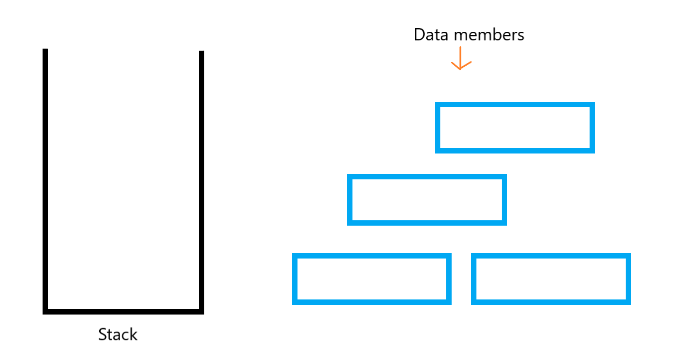

## Stack Data Structure
---
A stack is a linear data structure.Any operation on the stack is performed in **LIFO**(Last In First Out) or **FILO**(First In Last Out).

To understand this consider stack as a container which can store different data members in it.(look at this image)

We can put our data members in the container(stack) and can keep track of it.

#### Basic operations are performed in the stack:

* **Push**: Adds an item in the stack. If the stack is full, then it is said to be an Overflow condition.

Here we can see that data member 3 is inserted into the stack where data member 1 and 2 were already placed earler.
We can see that we can only put our new data member above the last one data  member(i.e. data member 2) 
 

* **Pop**: Removes an item from the stack. The items are popped in the reversed order in which they are pushed. If the stack is empty, then it is said to be an Underflow condition.

Here again we can see that we can pop(remove) the data only from the top most position here in this case member 3 is at top.
This is the reason why we call it LIFO or FILO
 
* **Peek** or **Top**: Returns the top element of the stack.
It keeps track of the top position of the stack.
* **isEmpty** / **isFull**: Returns true if the stack is empty, else false. It is checked every time when data is going to insert in the stack.
* 
 
### Implementation: 
There are two ways to implement a stack: 
* Using array
* Using linked list
