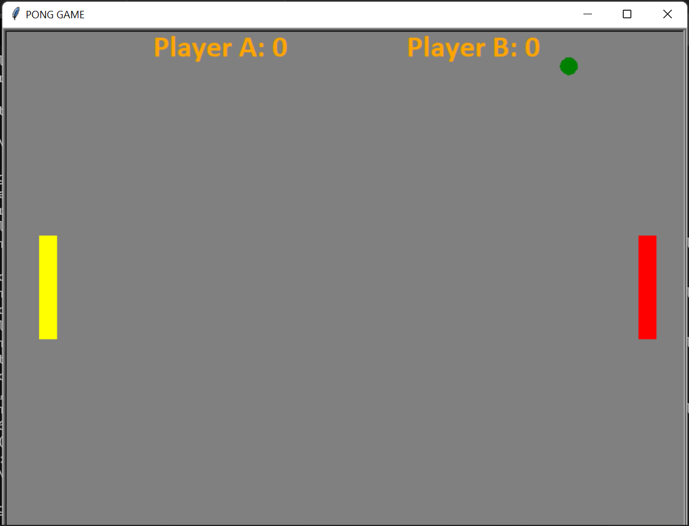

# PONG GAME

*    Pong is consider to be a classic game since long period of time.
*   Install all required packages by running `pip install -r requirements.txt` in terminal.
*   run command `python Pong_Game.py`, now enjoy the game.

### Screenshot

## Keyboard Controls

### For Player A:

	Use 'u' & 'e' to move paddle up & down respectively.

### For Player B:

	Use 'UP_ARROW' & 'DOWN_ARROW' to move paddle up & down respectively.
